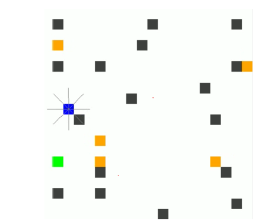
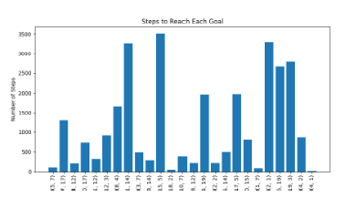
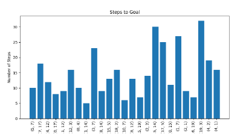
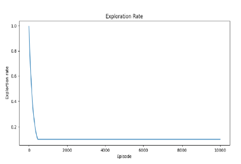

# Dynamic Obstacle Avoidance Using Q-Learning and Deep Q-Learning

## Overview

This project implements Q-Learning and Deep Q-Learning (DQL) techniques for dynamic obstacle avoidance in a simulated grid-based environment. The primary goal is to navigate an agent (representing a robot) from a starting point to a goal while avoiding static and dynamic (moving) obstacles. The agent uses ray sensors to detect obstacles and learns optimal paths through reinforcement learning.

### Methods

- **Q-Learning**: A tabular model-free RL algorithm that updates a Q-table to estimate rewards for state-action pairs.
- **Deep Q-Learning (DQL)**: An extension using a neural network to approximate Q-values, handling larger state spaces more effectively. It incorporates a replay buffer, epsilon-greedy exploration, and target networks for stability.

The project compares the performance of both methods across 25 predefined goal points, evaluating metrics like steps taken to reach goals and total rewards. Results show DQL generally requires fewer steps due to its ability to generalize better in dynamic environments.

### Technology Stack

- **Python 3.x** for implementation
- **Pygame** for simulation/visualization
- **PyTorch** for the DQL neural network
- **OpenCV** for video output

## Key Features

### Environment
- **Grid Size**: 500x500 pixels (20x20 cells)
- **Elements**:
  - Static obstacles (gray)
  - Dynamic obstacles (orange) - move randomly
  - Agent (blue)
  - Goal (green)



### Sensors
- 8 ray sensors around the agent
- Detection range: 2 cells
- Used to detect obstacles in the environment

### Actions
- Up, Down, Left, Right movements

### Reward System
- **+100**: Reaching the goal (resets goal for continued training)
- **-100**: Colliding with obstacles
- **Negative reward**: Proportional to distance to goal (encourages shorter paths)

### Dynamic Elements
- Moving obstacles shift randomly (20% probability per step)
- Dynamic obstacles avoid collisions with static obstacles and the goal

### Training/Testing
- **Q-Learning**: Trains on-the-fly during simulation
- **DQL**: 
  - Training: 10,000 episodes
  - Testing: 25 episodes with predefined goal

## Requirements

### Python Version
- Python 3.x

### Libraries
- `pygame`: For simulation and visualization
- `numpy`: For numerical computations
- `math`: Built-in for mathematical functions
- `torch` and `torch.nn`: For building and training the DQL neural network (PyTorch)
- `matplotlib.pyplot`: For plotting rewards, steps, and exploration rates
- `cv2` (OpenCV): For saving simulation frames as video (in DQL testing)
- `collections` (built-in): For deque in replay buffer
- `random` (built-in): For random actions and obstacle movements

## Usage

### 1. Q-Learning

Run the script to train and test the agent with 25 predefined goals.

**Command**:
```bash
python3 Q-learning.py
```

**What happens**:
- Initializes the environment with static/dynamic obstacles and agent at (10, 10)
- Trains on-the-fly using epsilon-greedy exploration (starts at 1.0, decays implicitly)
- Simulates navigation for each goal, visualizing in Pygame

**Outputs**:
- A bar plot showing steps required per goal
  

**Notes**:
- Initial learning may take time as the Q-table builds
- No separate training file—learning occurs during simulation

---

### 2. Deep Q-Learning (DQL)

#### Training

Run to train the model over 10,000 episodes with random goals.


**Command**:
```bash
python3 dqn_train.py
```

**What happens**:
- Agent starts at (10, 10)
- Uses epsilon-greedy exploration (starts at 1.0, decays to 0.1)
- Replay buffer size: 10,000
- Batch size: 32
- Learning rate: 0.001
- Discount factor: 0.99
- Saves the trained model as `dqn_model_train.pth`

**Outputs**:
- Plots for total rewards per episode and exploration rate decay
- 

**Training time**: ~10-30 minutes depending on hardware (CPU/GPU)

#### Testing

Load the pre-trained model and test on 25 predefined goals.

**Command**:
```bash
python3 dqn_test.py
```

**What happens**:
- Loads `dqn_model_train.pth`
- Simulates 25 episodes, moving dynamic obstacles randomly
- Visualizes in Pygame and saves frames as `output.mp4`

## Demo Video

[Watch the Demo Video](./output(2).mp4)

## Predefined Goals

The following 25 goals are used for comparison in both Q-Learning and DQL:

```
[(5, 7), (7, 17), (4, 12), (0, 17), (11, 12), (12, 3), (8, 4), (1, 14), 
 (3, 7), (8, 14), (15, 5), (18, 2), (10, 7), (8, 12), (15, 19), (2, 2), 
 (15, 14), (17, 5), (0, 15), (1, 7), (2, 1), (16, 19), (19, 3), (4, 2), 
 (4, 1)]
```
## Results and Comparison

### Q-Learning
- Relies on a Q-table
- Performs well but scales poorly with state space
- Average steps per goal: Higher due to tabular limitations

### Deep Q-Learning (DQL)
- Uses neural network approximation
- Fewer steps overall (generalizes better to unseen states)
- Includes replay buffer for efficient learning
- Two hidden layers (64 neurons each) with ReLU activation

### Key Findings
- DQL typically requires 20-50% fewer steps than Q-Learning for the same goals
- Rewards improve over episodes in DQL training, converging to higher values
- Exploration rate decays, shifting from random actions to policy exploitation

See the presentation for detailed plots and architecture diagrams.

---

## Files in Repository

- `Q-learning.py`: Main script for Q-Learning simulation and plotting
- `dqn_train.py`: DQL training script
- `dqn_test.py`: DQL testing script with video output
- `annotated-RL-FinalReport.pdf`: Full research paper
- `RL Final(1).pptx`: Project presentation slides
- `Readme.docx`: Original readme
- `dqn_model_train.pth`: Pre-trained DQL model (generated after training)

---
## Limitations and Future Work

### Current Limitations
- Environment is grid-based and 2D
- No multi-agent support
- Limited to discrete action space

### Future Enhancements
- **3D/Continuous Spaces**: Extend to 3D environments or continuous spaces
- **Multi-Agent Support**: Add cooperative/competitive agents
- **Hyperparameter Tuning**: Experiment with sensor range, network depth, or advanced variants (e.g., Double DQL, Dueling DQL)
- **Real-World Application**: Integrate with ROS for physical robots

---
